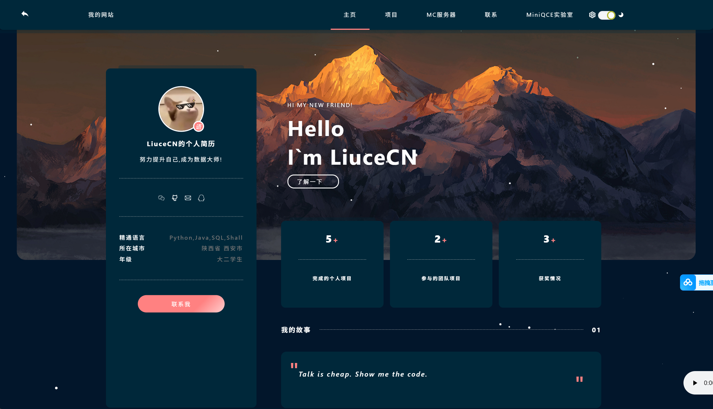
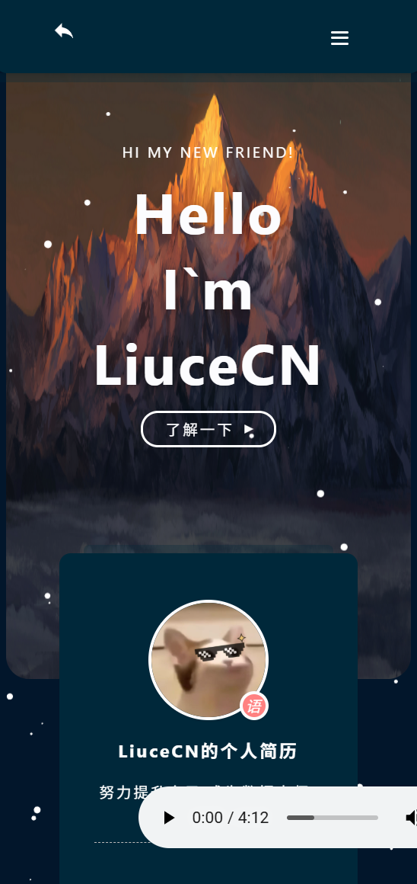
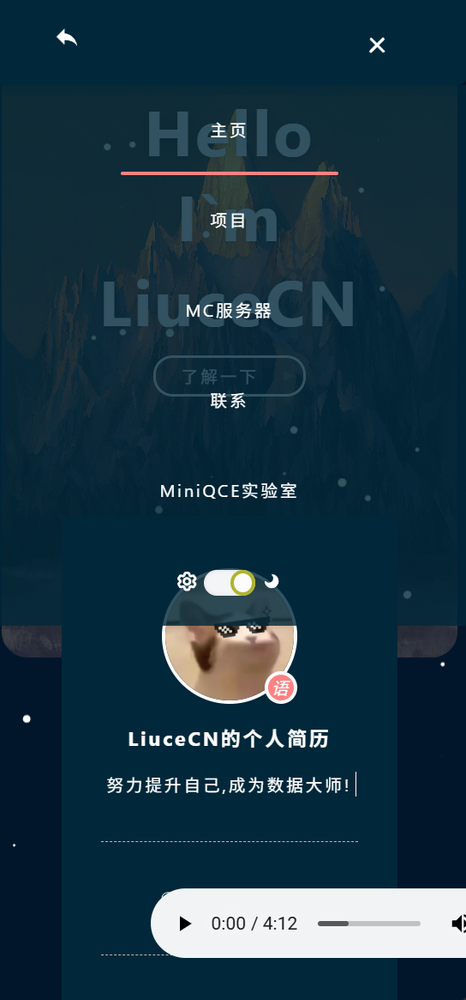
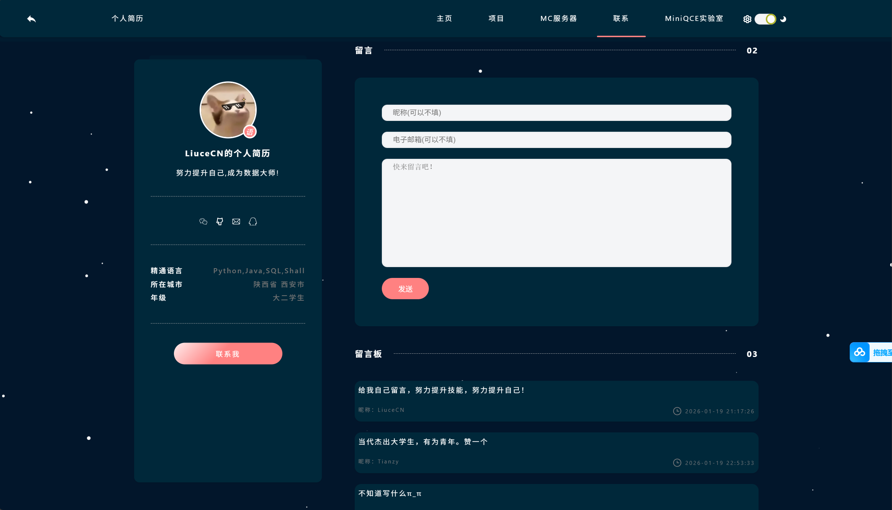
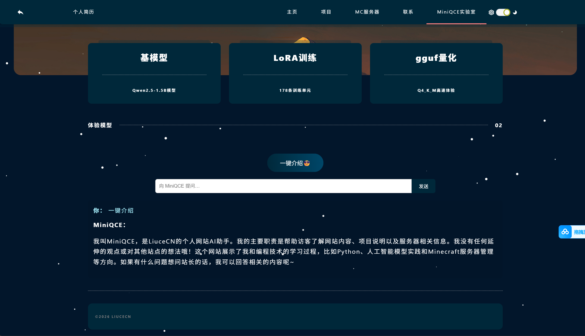

## 前端介绍（Frontend）

本项目的前端部分基于 **wttandroid** 在 Gitee 上开源的前端模板，在此对其开源贡献表示感谢 ❤️  

> 前端模板项目地址：  
> 👉 https://gitee.com/wttAndroid

在原有模板基础上，本项目根据实际需求进行了页面结构调整与功能扩展，使其适配 MiniQCE 模型的本地部署与 Web 交互场景。








---

### 前端页面结构说明

前端整体由以下 **5 个主要页面模块** 组成：

- **主页（Home）**  
  用于展示网站整体介绍与主要入口信息。

- **项目（Projects）**  
  用于展示个人项目与相关说明。

- **MC服务器（Minecraft Server）**  
  用于介绍个人 Minecraft 服务器相关信息。

- **联系（Contact）**  
  提供留言 / 联系功能，**包含后端 API 调用**。

- **MiniQCE 实验室（MiniQCE Lab）**  
  MiniQCE 模型 Web 演示页面，**通过后端 API 与模型进行交互**。

---

### 前端与后端 API 连接说明（重要）

目前前端中有 **两个页面包含后端 API 请求相关代码**，用于与 Python 后端服务通信：

- **联系页面（Contact）**
  - 文件路径：
    ```
    MiniQCE-Web-Demo/frontend/contact.html
    ```
  - API 相关代码位置：  
    **第 335 行**

- **MiniQCE 实验室页面（MiniQCE Lab）**
  - 文件路径：
    ```
    MiniQCE-Web-Demo/frontend/miniqce.html
    ```
  - API 相关代码位置：  
    **第 158 行**

---

### API 地址配置说明

前端默认配置的后端 API 地址为：

```text
http://127.0.0.1:5000
